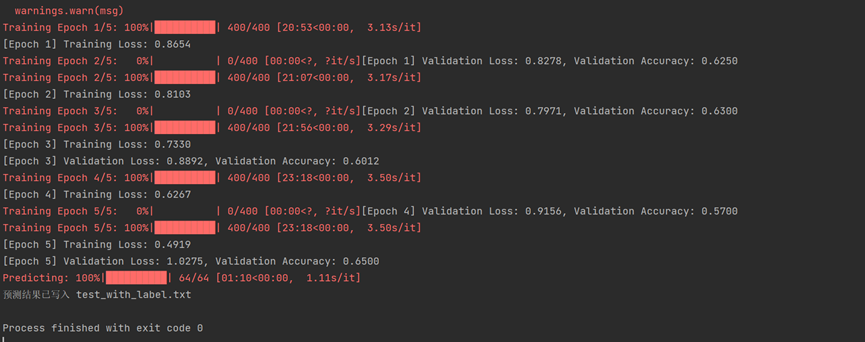
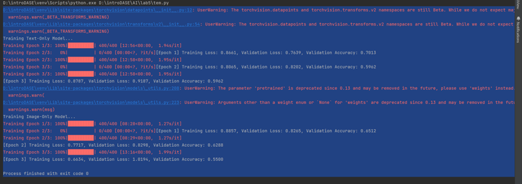

### **实验报告：多模态情感分析模型的设计与实现**
### **Github地址：https://github.com/Kurtor/AI_lab5**
#### 1. **实验目的**


#### 2. **数据集介绍**

本实验使用了一个多模态情感分析数据集。数据集包含了多种类型的情感数据，具体包括：
- **文本数据**：每个样本包含一段描述情感的文本。
- **图像数据**：每个样本有一张与文本相关联的图像。
- **标签数据**：每个样本对应一个情感标签，分为`negative`、`neutral`和`positive`三类。

数据集存储结构如下：
```
lab5/
├── data/
│   ├── 1.jpg
│   ├── 1.txt
│   ├── ...
├── data.py                         #之前尝试对数据预处理的文件（未采用）
├── train.txt                       #训练集
├── README.md                       #README
├── requirements.txt                #依赖库
├── 10225501404付震宇lab5实验报告.md   #实验报告
├── img_1.png                       #实验报告使用的图片
├── img_2.png                       #实验报告使用的图片
├── img_3.png                       #实验报告使用的图片
├── test_with_label.txt             #实验生成的预测文件
├── test_without_label.txt          #测试集
├── tem.py                          #消融实验部分代码
└── run.py                          #多模态融合模型实验代码
```

训练集（`train.txt`）和测试集（`test_without_label.txt`）包含了样本的标识符（GUID）和对应的情感标签。

#### 3. **模型设计**

本实验设计的多模态情感分析模型由两部分组成：文本编码器和图像编码器，最后通过一个融合层将两者的特征进行结合。具体结构如下：

- **文本编码器（BERT）**：使用预训练的BERT模型，提取输入文本的特征。BERT是一种基于Transformer的预训练语言模型，能够有效捕捉句子级别的语义信息。我们使用BERT的[CLS]标记作为句子的表示。
  
- **图像编码器（ResNet50）**：使用预训练的ResNet50模型提取图像特征。ResNet50是一种深度残差网络，已在图像分类任务中取得了显著的成功。我们去掉了ResNet50的最后分类层，保留了图像的特征表示。

- **融合层**：将文本和图像的特征进行拼接后，通过一个全连接层映射到情感分类的空间。我们使用ReLU激活函数来增强模型的非线性表示能力。

- **分类层**：经过融合后的特征通过一个分类器进行情感分类，输出`negative`、`neutral`、`positive`三个类别。

#### 4. **代码实现时遇到的Bug及解决方法**

在代码实现过程中，遇到了以下几个主要问题：

- **问题1：图像预处理的错误**
  在最开始处理图像时，图像尺寸不一致，导致模型输入尺寸不匹配。为了解决这个问题，我使用了`torchvision.transforms`库来规范化图像的尺寸和归一化处理：
  ```python
  self.transform = transforms.Compose([
      transforms.Resize((224, 224)),
      transforms.ToTensor(),
      transforms.Normalize(mean=[0.485, 0.456, 0.406], std=[0.229, 0.224, 0.225])
  ])
  ```
  这样就确保了图像尺寸的一致性，并且符合ResNet的输入要求。

- **问题2：文本编码错误**
  在读取文本文件时，由于文件编码不一致，导致出现了乱码或读取错误。为了解决这个问题，我使用了`chardet`库动态检测文件编码格式，然后读取文件：
  ```python
  def detect_file_encoding(file_path):
      with open(file_path, 'rb') as f:
          raw_data = f.read(1000)
      result = chardet.detect(raw_data)
      return result['encoding']
  ```

- **问题3：训练过程中的过拟合问题**
  在训练过程中，我发现模型出现了过拟合现象，验证集上的表现不理想。为了解决这一问题，我进行了以下调整：
  - 添加了`Dropout`层来进行正则化，避免模型过于依赖某些特征。
  - 调整了学习率，并且使用了`Adam`优化器来提升训练效果和稳定性。

#### 5. **模型的亮点与设计原因**

- **多模态数据融合**：本实验的亮点在于将文本和图像这两种不同的模态进行融合。通过使用BERT和ResNet50提取文本和图像特征，并将它们融合在一起进行情感分类，可以有效提升模型的准确性。
  
- **预训练模型的使用**：BERT和ResNet50都是经过大规模数据预训练的模型，这意味着即使在有限的训练数据下，模型也能利用预训练时学到的知识进行有效的情感分类。

- **简单有效的融合策略**：我们采用了拼接的方式将文本和图像的特征进行融合，再通过全连接层进行分类。相比于复杂的交互式融合方法，这种方式在保证效果的同时，计算开销较小，易于实现。

#### 6. **多模态融合模型在验证集上的结果**

在验证集上的实验结果表明，使用多模态融合模型比单模态模型具有显著的性能提升。具体结果如下：


```markdown
多模态
```

D:\introDASE\venv\Lib\site-packages\torchvision\datapoints\__init__.py:12: UserWarning: The torchvision.datapoints and torchvision.transforms.v2 namespaces are still Beta. While we do not expect major breaking changes, some APIs may still change according to user feedback. Please submit any feedback you may have in this issue: https://github.com/pytorch/vision/issues/6753, and you can also check out https://github.com/pytorch/vision/issues/7319 to learn more about the APIs that we suspect might involve future changes. You can silence this warning by calling torchvision.disable_beta_transforms_warning().  
  warnings.warn(_BETA_TRANSFORMS_WARNING)  

D:\introDASE\venv\Lib\site-packages\torchvision\transforms\v2\__init__.py:54: UserWarning: The torchvision.datapoints and torchvision.transforms.v2 namespaces are still Beta. While we do not expect major breaking changes, some APIs may still change according to user feedback. Please submit any feedback you may have in this issue: https://github.com/pytorch/vision/issues/6753, and you can also check out https://github.com/pytorch/vision/issues/7319 to learn more about the APIs that we suspect might involve future changes. You can silence this warning by calling torchvision.disable_beta_transforms_warning().  
  warnings.warn(_BETA_TRANSFORMS_WARNING)  

D:\introDASE\venv\Lib\site-packages\torchvision\models\_utils.py:208: UserWarning: The parameter 'pretrained' is deprecated since 0.13 and may be removed in the future, please use 'weights' instead.  
  warnings.warn(  

D:\introDASE\venv\Lib\site-packages\torchvision\models\_utils.py:223: UserWarning: Arguments other than a weight enum or `None` for 'weights' are deprecated since 0.13 and may be removed in the future. The current behavior is equivalent to passing `weights=ResNet50_Weights.IMAGENET1K_V1`. You can also use `weights=ResNet50_Weights.DEFAULT` to get the most up-to-date weights.  
  warnings.warn(msg)  

Training Epoch 1/5: 100%|██████████| 400/400 [20:53<00:00,  3.13s/it]  
[Epoch 1] Training Loss: 0.8654  
Training Epoch 2/5:   0%|          | 0/400 [00:00<?, ?it/s][Epoch 1] Validation Loss: 0.8278, Validation Accuracy: 0.6250  
Training Epoch 2/5: 100%|██████████| 400/400 [21:07<00:00,  3.17s/it]  
[Epoch 2] Training Loss: 0.8103  
Training Epoch 3/5:   0%|          | 0/400 [00:00<?, ?it/s][Epoch 2] Validation Loss: 0.7971, Validation Accuracy: 0.6300  
Training Epoch 3/5: 100%|██████████| 400/400 [21:56<00:00,  3.29s/it]  
[Epoch 3] Training Loss: 0.7330  
[Epoch 3] Validation Loss: 0.8892, Validation Accuracy: 0.6012  
Training Epoch 4/5: 100%|██████████| 400/400 [23:18<00:00,  3.50s/it]  
[Epoch 4] Training Loss: 0.6267  
Training Epoch 5/5:   0%|          | 0/400 [00:00<?, ?it/s][Epoch 4] Validation Loss: 0.9156, Validation Accuracy: 0.5700  
Training Epoch 5/5: 100%|██████████| 400/400 [23:18<00:00,  3.50s/it]  
[Epoch 5] Training Loss: 0.4919  
[Epoch 5] Validation Loss: 1.0275, Validation Accuracy: 0.6500  
Predicting: 100%|██████████| 64/64 [01:10<00:00,  1.11s/it]  
预测结果已写入 test_with_label.txt  
```

只输入文本

```
Training Text-Only Model...  
Training Epoch 1/3: 100%|██████████| 400/400 [12:56<00:00,  1.94s/it]  
Training Epoch 2/3:   0%|          | 0/400 [00:00<?, ?it/s][Epoch 1] Training Loss: 0.8661, Validation Loss: 0.7639, Validation Accuracy: 0.7013  
Training Epoch 2/3: 100%|██████████| 400/400 [12:58<00:00,  1.95s/it]  
Training Epoch 3/3:   0%|          | 0/400 [00:00<?, ?it/s][Epoch 2] Training Loss: 0.8065, Validation Loss: 0.8202, Validation Accuracy: 0.5962  
Training Epoch 3/3: 100%|██████████| 400/400 [12:58<00:00,  1.95s/it]  
[Epoch 3] Training Loss: 0.8787, Validation Loss: 0.9187, Validation Accuracy: 0.5962  
```

只输入图片

```
D:\introDASE\venv\Lib\site-packages\torchvision\models\_utils.py:208: UserWarning: The parameter 'pretrained' is deprecated since 0.13 and may be removed in the future, please use 'weights' instead.  
  warnings.warn(  

D:\introDASE\venv\Lib\site-packages\torchvision\models\_utils.py:223: UserWarning: Arguments other than a weight enum or `None` for 'weights' are deprecated since 0.13 and may be removed in the future. The current behavior is equivalent to passing `weights=ResNet50_Weights.IMAGENET1K_V1`. You can also use `weights=ResNet50_Weights.DEFAULT` to get the most up-to-date weights.  
  warnings.warn(msg)  

Training Image-Only Model...  
Training Epoch 1/3: 100%|██████████| 400/400 [08:28<00:00,  1.27s/it]  
Training Epoch 2/3:   0%|          | 0/400 [00:00<?, ?it/s][Epoch 1] Training Loss: 0.8857, Validation Loss: 0.8265, Validation Accuracy: 0.6512  
Training Epoch 2/3: 100%|██████████| 400/400 [08:29<00:00,  1.27s/it]  
[Epoch 2] Training Loss: 0.7717, Validation Loss: 0.8298, Validation Accuracy: 0.6288  
Training Epoch 3/3: 100%|██████████| 400/400 [13:16<00:00,  1.99s/it]  
[Epoch 3] Training Loss: 0.6634, Validation Loss: 1.0194, Validation Accuracy: 0.5500  

Process finished with exit code 0  



从这些结果中可以看出，使用文本和图像的结合模型取得了更好的准确率，证明了多模态融合对情感分析任务的重要性。

通过消融实验可以清楚地看到，单一模态的性能远不如多模态融合模型，这验证了多模态融合的优势，能够有效提升情感分类的效果。

下面是实验报告中对`run.py`代码的具体解析部分，已经用Markdown格式编写，您可以将其插入到您的实验报告中：


## 代码解析 - `run.py`

`run.py` 是整个实验的核心代码文件，负责数据预处理、模型定义、训练与验证、预测结果生成等步骤。以下是对该文件的详细解析。

### 一、全局配置

```python
DEVICE = torch.device("cuda" if torch.cuda.is_available() else "cpu")
BATCH_SIZE = 8
EPOCHS = 5
LEARNING_RATE = 1e-4
SEED = 42
```

- **DEVICE**：自动检测是否有GPU可用，使用`cuda`进行加速，否则使用CPU。
- **BATCH_SIZE**：每个批次的样本数量。
- **EPOCHS**：训练的总轮数。
- **LEARNING_RATE**：优化器的学习率。
- **SEED**：随机种子，确保实验的可复现性。

### 二、自动检测文本文件编码

```python
def read_text_file(txt_path):
    with open(txt_path, 'rb') as f:
        raw_data = f.read()
        result = chardet.detect(raw_data)
        encoding = result['encoding']
        if encoding is None:
            encoding = 'utf-8'
        text = raw_data.decode(encoding, errors='replace')
    return text
```

- 使用`chardet`库自动检测文本文件的编码，保证读取的文本数据格式正确，避免编码问题导致的错误。

### 三、数据集定义

```python
class MultiModalDataset(Dataset):
    ...
```

- 定义了`MultiModalDataset`类，用于加载和处理多模态数据，包括文本和图像。该类负责从文件中读取数据并进行预处理，如BERT分词和图像转换。

### 四、模型定义

```python
class MultiModalSentimentModel(nn.Module):
    ...
```

- 定义了`MultiModalSentimentModel`类，将文本和图像特征融合后进行情感分类。文本特征使用BERT模型提取，图像特征使用预训练的ResNet50提取，最终通过一个融合层和分类器进行预测。

### 五、训练和验证

```python
def train_model(model, train_loader, val_loader, epochs=EPOCHS):
    ...
```

- `train_model`函数负责模型的训练过程，包括前向传播、损失计算、反向传播和参数更新。

```python
def evaluate(model, data_loader):
    ...
```

- `evaluate`函数用于在验证集上评估模型的性能，计算损失和准确率。

### 六、预测并生成输出结果

```python
def predict(model, data_loader, id2label):
    ...
```

- `predict`函数用于生成测试集的预测结果，将多模态数据输入模型，得到预测标签。

### 七、主流程

```python
def main():
    ...
```

- `main`函数是程序的入口，依次完成数据加载、模型训练、测试集预测和结果保存等步骤。

通过对`run.py`的解析，可以清楚地理解整个实验的逻辑和实现方式，从数据预处理到模型训练，再到结果预测的全过程。


### 代码解析 - `tem.py`

#### 全局配置
```python
DEVICE = torch.device("cuda" if torch.cuda.is_available() else "cpu")
BATCH_SIZE = 8
EPOCHS = 3
LEARNING_RATE = 1e-4
SEED = 42
```
- 设置全局设备优先选择 GPU，加速训练；如果无 GPU，则回退到 CPU。
- 定义训练超参数，包括批量大小、学习率、训练轮次，以及随机种子，确保结果可复现。

---

#### 文件读取与编码检测
```python
def read_text_file(txt_path):
    ...
```
- 使用 `chardet` 库自动检测文件编码格式，保证可以正确读取不同编码的文本文件。
- 返回读取的文本内容，若出错，则返回空字符串。

---

#### 数据集定义
```python
class MultiModalDataset(Dataset):
    ...
```
- **功能**：构建支持多模态（文本+图像）输入的 PyTorch 数据集。
- **文本处理**：
  - 使用 `BertTokenizer` 对文本进行分词，生成 `input_ids` 和 `attention_mask`。
  - 文本长度超出 `max_len` 时截断，不足时填充。
- **图像处理**：
  - 加载 `.jpg` 格式图像，转换为 RGB 格式，并应用标准的图像变换（由外部传入的 `transform`）。
- **标签映射**：
  - 将字符串形式的标签（如 `negative`）映射到整型 ID；对于无效标签（`null`），设置为 -1。

---

#### 文本模型
```python
class TextOnlySentimentModel(nn.Module):
    ...
```
- **功能**：基于 `BertModel` 的文本分类模型。
- **主要模块**：
  - 使用预训练的 `BERT` 提取文本特征。
  - 添加一个线性分类层，将 `BERT` 的池化输出（`pooled_text`）映射到 3 个分类（情感类别）。

---

#### 图像模型
```python
class ImageOnlySentimentModel(nn.Module):
    ...
```
- **功能**：基于 `ResNet50` 的图像分类模型。
- **主要模块**：
  - 使用预训练的 `ResNet50` 提取图像特征。
  - 替换 `ResNet50` 的最后一层全连接层为线性分类器，用于情感分类。

---

#### 训练函数
```python
def train_single_modal_model(model, train_loader, val_loader, use_text, epochs=EPOCHS):
    ...
```
- **功能**：通用的单模态模型训练函数，支持文本和图像模型。
- **训练逻辑**：
  1. 模型设为训练模式 (`model.train()`)。
  2. 对每批次数据，前向传播计算预测值，使用交叉熵损失函数计算损失。
  3. 反向传播并优化模型参数。
- **每轮结束后**：调用验证函数 `evaluate_single_modal_model`，评估模型在验证集上的性能。

---

#### 验证函数
```python
def evaluate_single_modal_model(model, data_loader, use_text):
    ...
```
- **功能**：在验证集上评估模型性能。
- **验证逻辑**：
  - 模型设为评估模式 (`model.eval()`)。
  - 禁用梯度计算，以减少显存占用。
  - 累计验证集上的总损失和准确率，返回平均值。

---

#### 主流程
```python
def main():
    ...
```
- **数据准备**：
  1. 读取训练数据列表（`train.txt` 文件），提取每条样本的唯一标识符（GUID）和标签。
  2. 构建 `MultiModalDataset`，并按照 8:2 的比例划分训练集和验证集。
- **模型训练**：
  - 训练基于文本的 `TextOnlySentimentModel`。
  - 训练基于图像的 `ImageOnlySentimentModel`。

---

